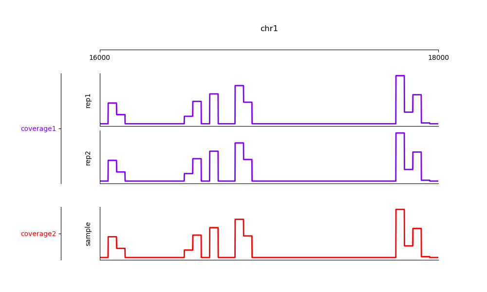
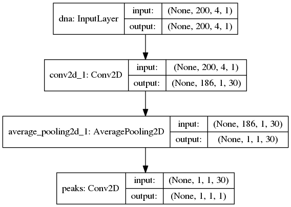
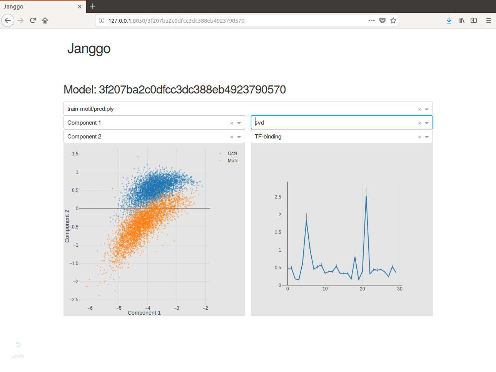

=========
Tutorial
=========

This tutorial is split in three parts.

Part I treats the Genomic Dataset
that are available through Janggu which can be directly consumed
by your keras model.
The tutorial illustates how to access genomics
data from various widely used file formats, including FASTA, BAM, BIGWIG, BED
and GFF for the purpose of using them as input to a deep learning application.
It illustrates a range of parameters to adapt the read out of genomics data
and it shows how the predictions or feature activities of a neural network
in numpy format can be converted to a genomic coverage representation
that can in turn be exported to BIGWIG file format
or visualized directly via a genome browser-like plot.

Part II treats utilities for defining a neural networks based on keras.

Part III illustrates Janggu's evaluation utilities.

Complementary to this tutorial, the janggu repository contains
a number of jupyter notebooks that illustrate for example with keras or
sklearn:

.. _notebook_tutorials:

+--------------------------------+
| Example notebooks              |
+================================+
| `keras cnn example`_           |
+--------------------------------+
| `sklearn example`_             |
+--------------------------------+
| `pytorch example`_             |
+--------------------------------+
| `janggu example I`_            |
+--------------------------------+
| `janggu example II`_           |
+--------------------------------+
| `reusing datasets with view`_  |
+--------------------------------+
| `hyperparameter optimization`_ |
+--------------------------------+
| `randomizing HDF5 data`_       |
+--------------------------------+
| `variant effect prediction`_   |
+--------------------------------+
| `plotting genome coverage`_    |
+--------------------------------+

.. _`keras cnn example`: https://nbviewer.jupyter.org/github/BIMSBbioinfo/janggu/blob/master/src/examples/keras_convnet_example.ipynb
.. _`sklearn example`: https://nbviewer.jupyter.org/github/BIMSBbioinfo/janggu/blob/master/src/examples/sklearn_example_with_kmers.ipynb
.. _`pytorch example`: https://nbviewer.jupyter.org/github/BIMSBbioinfo/janggu/blob/master/src/examples/pytorch_convnet_example.ipynb
.. _`janggu example I`: https://nbviewer.jupyter.org/github/BIMSBbioinfo/janggu/blob/master/src/examples/classify_nucleotide_sequences.ipynb
.. _`janggu example II`: https://nbviewer.jupyter.org/github/BIMSBbioinfo/janggu/blob/master/src/examples/janggu_convnet_examples.ipynb
.. _`reusing datasets with view`: https://nbviewer.jupyter.org/github/BIMSBbioinfo/janggu/blob/master/src/examples/janggu_convnet_examples_with_hdf5.ipynb
.. _`randomizing HDF5 data`: https://nbviewer.jupyter.org/github/BIMSBbioinfo/janggu/blob/master/src/examples/janggu_convnet_examples_with_hdf5.ipynb
.. _`variant effect prediction`: https://nbviewer.jupyter.org/github/BIMSBbioinfo/janggu/blob/master/src/examples/variant_effect_prediction.ipynb
.. _`plotting genome coverage`: https://nbviewer.jupyter.org/github/BIMSBbioinfo/janggu/blob/master/src/examples/plot_coverage.ipynb
.. _`hyperparameter optimization`: https://nbviewer.jupyter.org/github/BIMSBbioinfo/janggu/blob/master/src/examples/hyperparameter_optimization_w_janggu.ipynb

Furthermore, use cases
for predicting JunD binding, training and adapting published genomics models
as well as a regression model example are demonstrated in
the supplementary repository: `Janggu use cases`_

.. _`Janggu use cases`: https://github.com/wkopp/janggu_usecases

Part I) Introduction to Genomic Datasets
-----------------------------------------

.. sidebar:: Genomic Datasets

   Most of the parameters are consistent across
   :class:`Bioseq` and :class:`Cover`.

:mod:`janggu.data` provides Dataset classes
that can be used for
training and evaluating neural networks.
Of particular importance are the Genomics-specific dataset,
:class:`Bioseq` and :class:`Cover` which
allow easy access to genomics data,
including DNA sequences or coverage information.
Apart from accessing raw genomics data, :code:`Janggu`
also facilitates a method for converting an ordinary
numpy array (e.g. predictions obtained from a neural net)
to a :code:`Cover` object. This enables the user to export the predictions
as BIGWIG format or interactively plot genome browser tracks.
In this tutorial, we demonstrate some of the key functionality of
Janggu. Further details are available in :ref:`storage`
and :ref:`reference-label`.

Bioseq
^^^^^^^^^^
The :class:`Bioseq` can be used to load nucleotide
or protein sequence data from
fasta files or from a reference genome
along with a set of genomic coordinates defining the region of interest (ROI).
The class facilitates access the
*one-hot encoding* representation of the sequences.
Specifically,
the *one-hot encoding* is represented as a
4D array with dimensions corresponding
to :code:`(region, region_length, 1, alphabet_size)`.
The Bioseq offers a number of features:

1. Strand-specific sequence extraction (if DNA sequences are extracted from the reference genome)
2. Higher-order one-hot encoding, e.g. di-nucleotide based

Sequences can be loaded in two ways: using
:code:`Bioseq.create_from_seq` or
:code:`Bioseq.create_from_refgenome`.
The former constructor method can be used to load
DNA or protein sequences from fasta files directly
or from as list of :code:`Bio.SeqRecord.SeqRecord` entries.
An example is shown below:

.. code-block:: python

   from pkg_resources import resource_filename
   from janggu.data import Bioseq

   fasta_file = resource_filename('janggu',
                                  'resources/sample.fa')

   dna = Bioseq.create_from_seq(name='dna',
                                fastafile=fasta_file)

   # there are 3897 sequences in the in sample.fa
   len(dna)

   # Each sequence is 200 bp of length
   dna.shape  # is (3897, 200, 1, 4)

   # One-hot encoding for the first 10 bases of the first region
   dna[0][0, :10, 0, :]

Furthermore, it is possible to trim variable sequence length using
the :code:`fixedlen` option. If specfied, all sequences will be truncated
or zero-padded to length `fixedlen`. For example,

.. code-block:: python

   dna = Bioseq.create_from_seq(name='dna',
                                fastafile=fasta_file,
                                fixedlen=205)

   # Each sequence is 205 bp of length
   dna.shape  # is (3897, 205, 1, 4)

   # the last 5 position were zero padded
   dna[0][0, -6:, 0, :]

Alternatively, nucleotide sequences can be
obtained from a reference genome directly along with
a BED or GFF file that indicates the region of interest (ROI).

If each interval in the BED-file already corresponds
to a 'datapoint' that shall be consumed during training, like it
is the case for 'sample_equalsize.bed', the associated DNA sequences
can be loaded according to

.. code-block:: python

   roi = resource_filename('janggu',
                           'resources/sample_equalsize.bed')
   refgenome = resource_filename('janggu',
                                 'resources/sample_genome.fa')

   dna = Bioseq.create_from_refgenome(name='dna',
                                      refgenome=refgenome,
                                      roi=roi)

   dna.shape  # is (4, 200, 1, 4)
   # One-hot encoding of the first 10 nucleotides in region 0
   dna[0][0, :10, 0, :]

Sometimes it is more convenient to provide the ROI
as a set of variable-sized broad intervals
(e.g. chr1:10000-50000 and chr3:4000-8000)
which should be divided into sub-intervals
of equal length (e.g. of length 200 bp).
This can be achieved
by explicitly specifying a desired :code:`binsize`
and :code:`stepsize` as shown below:

.. code-block:: python

   roi = resource_filename('janggu',
                           'resources/sample.bed')

   # loading non-overlapping intervals
   dna = Bioseq.create_from_refgenome(name='dna',
                                      refgenome=refgenome,
                                      roi=roi,
                                      binsize=200,
                                      stepsize=200)

   dna.shape  # is (100, 200, 1, 4)

   # loading mutually overlapping intervals
   dna = Bioseq.create_from_refgenome(name='dna',
                                      refgenome=refgenome,
                                      roi=roi,
                                      binsize=200,
                                      stepsize=50)

   dna.shape  # is (394, 200, 1, 4)

The argument :code:`flank` can be used to extend
the intervals up and downstream by a given length

.. code-block:: python

   dna = Bioseq.create_from_refgenome(name='dna',
                                      refgenome=refgenome,
                                      roi=roi,
                                      binsize=200,
                                      stepsize=200,
                                      flank=100)

   dna.shape  # is (100, 400, 1, 4)

Finally, sequences can be represented using **higher-order**
one-hot representation using the :code:`order` argument. An example
of a di-nucleotide-based one-hot representation is shown below

.. code-block:: python

   dna = Bioseq.create_from_refgenome(name='dna',
                                      refgenome=refgenome,
                                      roi=roi,
                                      binsize=200,
                                      stepsize=200,
                                      order=2)

   # is (100, 199, 1, 16)
   # that is the last dimension represents di-nucleotides
   dna.shape

Cover
^^^^^
:class:`Cover` can be utilized to fetch different kinds of
coverage data from commonly used data formats,
including BAM, BIGWIG, BED and GFF.
Coverage data is stored as a 4D array with dimensions corresponding
to :code:`(region, region_length, strand, condition)`.

The following examples illustrate some use cases for :class:`Cover`,
including loading, normalizing coverage data.
Additional features are described in the :ref:`reference-label`.

**Loading read count coverage from BAM files** is supported for
single-end and paired-end alignments. For the single-end case
reads are counted on the 5'-end and and for paired-end alignments,
reads are optionally counted at the mid-points or 5' ends of the first mate.
The following example illustrate how to extract base-pair resolution coverage
with and without strandedness.

.. code:: python

   from janggu.data import Cover

   bam_file = resource_filename('janggu',
                                'resources/sample.bam')

   roi = resource_filename('janggu',
                           'resources/sample.bed')

   cover = Cover.create_from_bam('read_count_coverage',
                                 bamfiles=bam_file,
                                 binsize=200,
                                 stepsize=200,
                                 roi=roi)

   cover.shape  # is (100, 200, 2, 1)
   cover[0]  # coverage of the first region

   # Coverage regardless of read strandedness
   # sums reads from both strand.
   cover = Cover.create_from_bam('read_coverage',
                                 bamfiles=bam_file,
                                 binsize=200,
                                 stepsize=200,
                                 stranded=False,
                                 roi=roi)

   cover.shape  # is (100, 200, 1, 1)

Sometimes it is desirable to determine the read
count coverage in say 50 bp bins which can be
controlled by the :code:`resolution` argument.
Consequently, note that the second dimension amounts
to length 4 using `binsize=200` and `resolution=50` in the following example

.. code:: python

   # example with resolution=200 bp
   cover = Cover.create_from_bam('read_coverage',
                                 bamfiles=bam_file,
                                 binsize=200,
                                 resolution=50,
                                 roi=roi)

   cover.shape  # is (100, 4, 2, 1)

It might be desired to aggregate reads across entire interval
rather than binning the genome to equally sized bins of
length :code:`resolution`. An example application for this would
be to count reads per possibly variable-size regions (e.g. genes).
This can be achived by :code:`resolution=None` which results
in the second dimension being collapsed to a length of one.

.. code:: python

   # example with resolution=None
   cover = Cover.create_from_bam('read_coverage',
                                 bamfiles=bam_file,
                                 binsize=200,
                                 resolution=None,
                                 roi=roi)

   cover.shape  # is (100, 1, 2, 1)

Similarly, if strandedness is not relevant we may use

.. code:: python

   # example with resolution=None without strandedness
   cover = Cover.create_from_bam('read_coverage',
                                 bamfiles=bam_file,
                                 binsize=200,
                                 resolution=None,
                                 stranded=False,
                                 roi=roi)

   cover.shape  # is (100, 1, 1, 1)

Finally, it is possible to normalize the coverage profile, e.g.
to account for differences in sequencing depth across experiments
using the :code:`normalizer` argument

.. code:: python

   # example with resolution=None without strandedness
   cover = Cover.create_from_bam('read_coverage',
                                 bamfiles=bam_file,
                                 binsize=200,
                                 resolution=None,
                                 stranded=False,
                                 normalizer='tpm',
                                 roi=roi)

   cover.shape  # is (100, 1, 1, 1)

More details on alternative normalization
options are discussed in :ref:`storage`.

**Loading signal coverage from BIGWIG files**
can be achieved analogously:

.. code-block:: python

   roi = resource_filename('janggu',
                           'resources/sample.bed')
   bw_file = resource_filename('janggu',
                               'resources/sample.bw')

   cover = Cover.create_from_bigwig('bigwig_coverage',
                                    bigwigfiles=bw_file,
                                    roi=roi,
                                    binsize=200,
                                    stepsize=200)

   cover.shape  # is (100, 200, 1, 1)

When applying signal aggregation using e.g :code:`resolution=50` or :code:`resolution=None`,
additionally, the aggregation method can be specified using
the :code:`collapser` argument.
For example, in order to represent the resolution sized
bin by its mean signal the following snippet may be used:

.. code-block:: python

   cover = Cover.create_from_bigwig('bigwig_coverage',
                                    bigwigfiles=bw_file,
                                    roi=roi,
                                    binsize=200,
                                    resolution=None,
                                    collapser='mean')

   cover.shape  # is (100, 1, 1, 1)

More details on alternative collapse
options are discussed in :ref:`storage`.

**Coverage from a BED files** is largely analogous to extracting coverage
information from BAM or BIGWIG files, but in addition it is possible to interpret
BED files in various ways:

1. **Binary** or Presence/Absence mode interprets the ROI as the union of positive and negative cases in a binary classification setting and regions contained in :code:`bedfiles` as positive examples.
2. **Score** mode reads out the real-valued score field value from the associated regions.
3. **Categorical** mode transforms integer-valued scores into one-hot representation. For that option, each of the `nclasses` corresponds to an integer ranging from zero to :code:`nclasses - 1`.

Examples of loading data from a BED file are shown below

.. code-block:: python

   roi = resource_filename('janggu',
                           'resources/sample.bed')
   score_file = resource_filename('janggu',
                                  'resources/scored_sample.bed')

   # binary mode (default)
   cover = Cover.create_from_bed('binary_coverage',
                                 bedfiles=score_file,
                                 roi=roi,
                                 binsize=200,
                                 stepsize=200,
                                 collapser='max',
                                 resolution=None)

   cover.shape  # is (100, 1, 1, 1)
   cover[4]  # contains [[[[1.]]]]

   # score mode
   cover = Cover.create_from_bed('score_coverage',
                                 bedfiles=score_file,
                                 roi=roi,
                                 binsize=200,
                                 stepsize=200,
                                 resolution=None,
                                 collapser='max',
                                 mode='score')

   cover.shape  # is (100, 1, 1, 1)
   cover[4]  # contains the score [[[[5.]]]]

   # categorical mode
   cover = Cover.create_from_bed('cat_coverage',
                                 bedfiles=score_file,
                                 roi=roi,
                                 binsize=200,
                                 stepsize=200,
                                 resolution=None,
                                 collapser='max',
                                 mode='categorical')

   cover.shape  # is (100, 1, 1, 6)
   cover[4]  # contains [[[[0., 0., 0., 0., 0., 1.]]]]

Dataset wrappers
^^^^^^^^^^^^^^^^^

In addition to the core datset :code:`Bioseq` and :code:`Cover`, Janggu offers convenience wrappers
to transform them in various ways.
For instance, :code:`ReduceDim` can be used to convert a 4D coverage dataset into 2D table like object.
That is it may be used to transform the dimensions
:code:`(region, region_length, strand, condition)` to :code:`(region, condition)` by
aggregating over the middle two dimensions.

.. code:: python

   from janggu.data import ReduceDim

   data = ReduceDim(cover, aggregator='sum')

Other dataset wrappers can be used in order to perform data augmentation, including
:code:`RandomSignalScale` and :code:`RandomOrientation` which can be used
to randomly alter the signal intensity during model fitting and randomly flipping
the 5' to 3' orientations of the coverage signal.

For more specialized cases, these wrappers might also be a good starting point
to derive or adapt from.

Using the Genomic Datasets with keras or sklearn
^^^^^^^^^^^^^^^^^^^^^^^^^^^^^^^^^^^^^^^^^^^^^^^^^

The above mentioned datasets :code:`Bioseq` and :code:`Cover`
are directly compatible with keras and sklearn models. An illustration of a
simple convolutional neural network with keras is shown in
`keras cnn example`_.
Moreover, an example of a logistic regression model from sklearn used with Janggu
is shown in
`sklearn example`_.

Converting a Numpy array to :code:`Cover`
^^^^^^^^^^^^^^^^^^^^^^^^^^^^^^^^^^^^^^^^^

After having trained and performed predictions with a model, the data
is represented as numpy array. A convenient way to reassociate the
predictions with the genomic coordinates they correspond to is achieved
using :code:`create_from_array`.

.. code:: python

   import numpy as np

   # True labels may be obtained from a BED file
   cover = Cover.create_from_bigwig('cov',
                                     bigwigfiles=bw_file,
                                     roi=roi,
                                     binsize=200,
                                     resolution=50)

   # Let's pretend to have derived predictions from a NN
   # of the same shape
   predictions = np.random.randn(*cover.shape)*.1 + cover[:]

   # We can reassociate the predictions with the genomic coordinates
   # of a :code:`GenomicIndexer` (in this case, cover.gindexer).
   predictions = Cover.create_from_array('predictions',
                                         predictions, cover.gindexer)

Exporting and visualizing :code:`Cover`
^^^^^^^^^^^^^^^^^^^^^^^^^^^^^^^^^^^^^^^

After having converted the predictions or feature activities of a neural
network to a :code:`Cover` object, it is possible to export the results
as BIGWIG format for further investigation in a genome browser of your choice

.. code:: python

   # writes the predictions to a specified folder
   predictions.export_to_bigwig(output_dir = './')

which should result in a file 'predictions.Cond_0.bigwig'.

Furthermore, it is possible to visualize the tracks interactively

.. code:: python

   from janggu.data import LineTrack
   from janggu.data import plotGenomeTrack

   fig = plotGenomeTrack([LineTrack(cover), LineTrack(predictions)], 'chr1', 16000, 18000).figsave('coverage.png')

Part II) Building a neural network with Janggu
-----------------------------------------------

While the Genomic Dataset may be used directly with keras,
this part of the tutorial discusses the :class:`Janggu` wrapper class
for a keras model.
It offers the following features:

1. Building models using automatic input and output layer shape inference
2. Built-in logging functionality
3. Automatic evaluation through the attachment of Scorer callbacks

A list of examples can be found in the :ref:`Table <notebook_tutorials>` at the beginning.

.. sidebar:: Datasets are named

   Dataset names must match with the Input and Output layers of the neural
   network.

A neural network can be created by
instantiating a :class:`Janggu` object.
There are two ways of achieving this:

1. Similar as with `keras.models.Model`, a :class:`Janggu` object can be created from a set of native keras Input and Output layers, respectively.
2. Janggu offers a `Janggu.create` constructor method which helps to reduce redundant code when defining many rather similar models.

Example 1: Instantiate Janggu similar to keras.models.Model
^^^^^^^^^^^^^^^^^^^^^^^^^^^^^^^^^^^^^^^^^^^^^^^^^^^^^^^^^^^^

.. sidebar:: **Model name**

   Model results,
   e.g. trained parameters, are automatically stored with the associated model name. To simplify the determination of a unique name for the model, Janggu automatically derives the model name based on a md5-hash of the network configuration. However, you can also specify a name yourself.

.. code-block:: python

  from keras.layers import Input
  from keras.layers import Dense

  from janggu import Janggu

  # Define neural network layers using keras
  in_ = Input(shape=(10,), name='ip')
  layer = Dense(3)(in_)
  output = Dense(1, activation='sigmoid',
                 name='out')(layer)

  # Instantiate model name.
  model = Janggu(inputs=in_, outputs=output)
  model.summary()

Example 2: Specify a model using a model template function
^^^^^^^^^^^^^^^^^^^^^^^^^^^^^^^^^^^^^^^^^^^^^^^^^^^^^^^^^^^^^
As an alternative to the above stated variant, it is also possible to specify
a network via a python function as in the following example

.. code-block:: python

   def model_template(inputs, inp, oup, params):
       inputs = Input(shape=(10,), name='ip')
       layer = Dense(params)(inputs)
       output = Dense(1, activation='sigmoid',
                      name='out')(layer)
       return inputs, output

   # Defines the same model by invoking the definition function
   # and the create constructor.
   model = Janggu.create(template=model_template,
                         modelparams=3)

The model template function must adhere to the
signature :code:`template(inputs, inp, oup, params)`.
Notice, that :code:`modelparams=3` gets passed on to :code:`params`
upon model creation. This allows to parametrize the network
and reduces code redundancy.

From the model template it is also possible to obtain
a keras model directly, rather than the Janggu model wrapper if this is preferred

.. code-block:: python

   from janggu import create_model

   # This will construct a keras model directly
   model = create_model(template=model_template,
                        modelparams=3)

Example 3: Automatic Input and Output layer extension
^^^^^^^^^^^^^^^^^^^^^^^^^^^^^^^^^^^^^^^^^^^^^^^^^^^^^^^^^^^^^
A second benefit to invoke :code:`Janggu.create` is that it can automatically
determine and append appropriate Input and Output layers to the network.
This means, only the network body remains to be defined.

.. code-block:: python

    import numpy as np
    from janggu import inputlayer, outputdense
    from janggu.data import Array

    # Some random data
    DATA = Array('ip', np.random.random((1000, 10)))
    LABELS = Array('out', np.random.randint(2, size=(1000, 1)))

    # inputlayer and outputdense automatically
    # extract dataset shapes and extend the
    # Input and Output layers appropriately.
    # That is, only the model body needs to be specified.
    @inputlayer
    @outputdense('sigmoid')
    def model_body_template(inputs, inp, oup, params):
        with inputs.use('ip') as layer:
            # the with block allows
            # for easy access of a specific named input.
            output = Dense(params)(layer)
        return inputs, output

    # create the model.
    model = Janggu.create(template=model_body_template,
                          modelparams=3,
                          inputs=DATA, outputs=LABELS)
    model.summary()

As is illustrated by the example, automatic Input and Output layer determination
can be achieved by using the decorators :code:`inputlayer` and/or
:code:`outputdense` which extract the layer dimensions from the
provided input and output Datasets in the create constructor.

Fit a neural network on DNA sequences
^^^^^^^^^^^^^^^^^^^^^^^^^^^^^^^^^^^^^
In the previous sections, we learned how to acquire data and
how to instantiate neural networks. Now let's
create and fit a simple convolutional neural network that learns
to discriminate between two classes of sequences. In the following example
the sample sequences are of length 200 bp each. `sample.fa` contains Oct4 CHip-seq
peaks and sample2.fa contains Mafk CHip-seq peaks. We shall use a simple
convolutional neural network with 30 filters of length 21 bp to learn
the sequence features that discriminate the two sets of sequences.

The example makes use of two more janggu utilities: First,
:code:`DnaConv2D` constitutes a keras layer wrapper that facilitates scanning
of both DNA strands with the same kernels. That is it simulataneously applies
a convolution and a cross-correlation and aggregates the resulting activities.
Second, the example illustrates the dataset wrapper :code:`ReduceDim` which
allows to collapse 4D the signal contained in the Cover object
across the sequence length and strand dimension. The result is yields a 2D
table-like dataset which is used in the subsequent model fitting example.

.. code:: python

   from keras.layers import Conv2D
   from keras.layers import AveragePooling2D
   from janggu import inputlayer
   from janggu import outputconv
   from janggu import DnaConv2D
   from janggu.data import ReduceDim

   # load the dataset which consists of
   # 1) a reference genome
   REFGENOME = resource_filename('janggu', 'resources/pseudo_genome.fa')
   # 2) ROI contains regions spanning positive and negative examples
   ROI_FILE = resource_filename('janggu', 'resources/roi_train.bed')
   # 3) PEAK_FILE only contains positive examples
   PEAK_FILE = resource_filename('janggu', 'resources/scores.bed')

   # DNA sequences are loaded directly from the reference genome
   DNA = Bioseq.create_from_refgenome('dna', refgenome=REFGENOME,
                                      roi=ROI_FILE,
                                      binsize=200)

   # Classification labels over the same regions are loaded
   # into the Coverage dataset.
   # It is important that both DNA and LABELS load with the same
   # binsize, stepsize to ensure
   # the correct correspondence between both datasets.
   # Finally, the ReduceDim dataset wrapper transforms the 4D Coverage
   # object into a 2D table like object (regions by conditions)
   LABELS = ReduceDim(Cover.create_from_bed('peaks', roi=ROI_FILE,
                                  bedfiles=PEAK_FILE,
                                  binsize=200,
                                  resolution=None), aggregator='mean')

   # 2. define a simple conv net with 30 filters of length 15 bp
   # and relu activation.
   # outputconv as opposed to outputdense will put a conv layer as output
   @inputlayer
   @outputdense('sigmoid')
   def double_stranded_model(inputs, inp, oup, params):
       with inputs.use('dna') as layer:
           # The DnaConv2D wrapper can be used with Conv2D
           # to scan both DNA strands with the weight matrices.
           layer = DnaConv2D(Conv2D(params[0], (params[1], 1),
                                    activation=params[2]))(layer)

       output = GlobalAveragePooling2D(name='motif')(layer)
       return inputs, output

   # 3. instantiate and compile the model
   model = Janggu.create(template=double_stranded_model,
                         modelparams=(30, 15, 'relu'),
                         inputs=DNA, outputs=LABELS)
   model.compile(optimizer='adadelta', loss='binary_crossentropy',
                 metrics=['acc'])

   # 4. fit the model
   model.fit(DNA, ReduceDim(LABELS, epochs=100)

An illustration of the network architecture is depicted below.
Upon creation of the model a network depiction is
automatically produced in :code:`<results_root>/models` which is illustrated
below

After the model has been trained, the model parameters and the
illustration of the architecture are stored in :code:`<results_root>/models`.
Furthermore, information about the model fitting, model and dataset dimensions
are written to :code:`<results_root>/logs`.

Note that in the example above the output dimensionality of the network is 4D.
However, it might be more convenient at times to remove the single dimensional
elements of the array.
This can be achieved by wrapping the LABELS dataset using :code:`ReduceDim`.
In this case the example becomes

.. code:: python

   @inputlayer
   @outputdense('sigmoid')
   def double_stranded_model(inputs, inp, oup, params):
       with inputs.use('dna') as layer:
           # The DnaConv2D wrapper can be used with Conv2D
           # to scan both DNA strands with the weight matrices.
           layer = DnaConv2D(Conv2D(params[0], (params[1], 1),
                                    activation=params[2]))(layer)

       output = GlobalAveragePooling2D(name='motif')(layer)
       return inputs, output

   # 3. instantiate and compile the model
   model = Janggu.create(template=double_stranded_model,
                         modelparams=(30, 15, 'relu'),
                         inputs=DNA, outputs=ReduceDim(LABELS))
   model.compile(optimizer='adadelta', loss='binary_crossentropy',
                 metrics=['acc'])

   # 4. fit the model
   model.fit(DNA, ReduceDim(LABELS), epochs=100)

Part III) Evaluation and interpretation of the model
-----------------------------------------------------

Janggu supports various methods to evaluate and interprete a trained model,
including evaluating summary scores, inspecting the results in
the built-in genome browser (see Part I), evaluating the integrated gradients
which allows to visualized input feature importance and by
offering support for variant effect predictions.
In this last part we will illustrate these aspects.

Evaluation of summary scores
^^^^^^^^^^^^^^^^^^^^^^^^^^^^^^^^^^^

After the model has been trained, the quality of the predictions
is usually summarized by its agreement with the ground truth, e.g. by
evaluating the area under the ROC curve in a binary classification application
or by computing the correlation between predictions and targets in a regression
setting.

For some commonly used evaluation criteria, the evaluate method directly allows
to determine and export the given metric results.
For example, for a classification task the following line
evaluates the ROC and PRC and exports a figure and a tsv file, respectively,
for each measure.

.. code-block:: python

   model.evaluate(DNA_TEST, LABELS_TEST, callbacks=['roc', 'prc', 'auprc', 'auroc'])

The results are stored in :code:`<results_root>/evaluation/{roc,prc}.png`
as well as :code:`<results_root>/evaluation/{auroc,auprc}.tsv`.

Furthermore, for a regression setting it is possible to invoke

.. code-block:: python

   model.evaluate(DNA_TEST, LABELS_TEST, callbacks=['cor', 'mae', 'mse', 'var_explained'])

which evaluates the Pearson's correlation, the mean absolute error, the mean squared error
and the explained variance into tsv files.

It is also possible to customize the scoring callbacks by instantiating a
:code:`Scorer` objects which can be passed to
:code:`model.evaluate` and :code:`model.predict`. Further details about
customizing the scoring callbacks are given in :doc:`custom_scorer`.

Input feature importance
^^^^^^^^^^^^^^^^^^^^^^^^^^^^^^^^^^^

In order to inspect what the model has learned,
it is possible to identify the most important features in the input space
using the integrated gradients method.

This is illustrated on a toy example for discriminating Oct4 and Mafk binding sites (see
`variant effect prediction`_).

Variant effect prediction
^^^^^^^^^^^^^^^^^^^^^^^^^^^

In order to measure the effect of single nucleotide variant on the predict
network output can be tested via the :code:`Janggu.predict_variant_effect`
based on a Bioseq object and single nucleotide variants in VCF format.
This method evaluates the network for each variant (using its sequence context)
as well as its respective reference sequence.
As a result, an hdf5 file and a bed file will be produced which
contain the network predictions for each variant and the associated genomic
loci.
An illustration of the variant effect prediction in the notebook (see
`variant effect prediction`_).

Browse through the results
^^^^^^^^^^^^^^^^^^^^^^^^^^
Finally, after you have fitted and evaluated your results
you can browse through the results in an web browser of your choice.

To this end, first start the web application server

::

   janggu -path <results-root>

Then you can inspect the outputs in a browser of your choice
(default: localhost:8050)

